

<!-- PROJECT LOGO -->
 

  

# Stream Overlay

*A tool for setting up a professional overlay for the Age of Empires series*

**Developer:** VladTheJunior 
**Current version:** 0.3.3 

[Download Installer from Goolge Drive](https://drive.google.com/file/d/1AGZmd86wbJcniP1xL6v4WjT9JrWvGBEz/view?usp=sharing) 
[Download Portable (.ZIP archive)](https://github.com/VladTheJunior/StreamOverlayUpdates/archive/refs/heads/master.zip) 

*__Note:__ Portable version may require .NET6 desktop runtime: https://dotnet.microsoft.com/en-us/download/dotnet/6.0*

*__Another Note__: Versions below .NET 6.0.5 had a bug with displaying tooltips. Be sure that you are using an updated version of .NET if you find this bug.*

## Table of Contents

* [About the Project](#about-the-project)
* [Screenshots](#screenshots)
* [License](#license)
* [Contact](#contact)
* [Acknowledgements](#acknowledgements)

<!-- ABOUT THE PROJECT -->
## About The Project

This project is aimed at improving the quality of streamers' content. Overlay can be set before the start of events such as tournaments or showmatches, or during breaks. The advantages of this tool over manual configuration in OBS Studio are ease of installation and high quality overlay in just a minute.
The original intent of the app was to make it easy to create an overlay for ESOC streamers, but now it's aimed at regular streamers as well.

Visit [wiki page](https://github.com/VladTheJunior/StreamOverlay/wiki) for detailed guide.

Or watch detailed video guide by Joshua:

You can also join my discord server to stay up to date with the latest updates and news about my current developments and projects: [Commando Squad](https://discord.gg/egcZRKgj4q)

## Screenshots

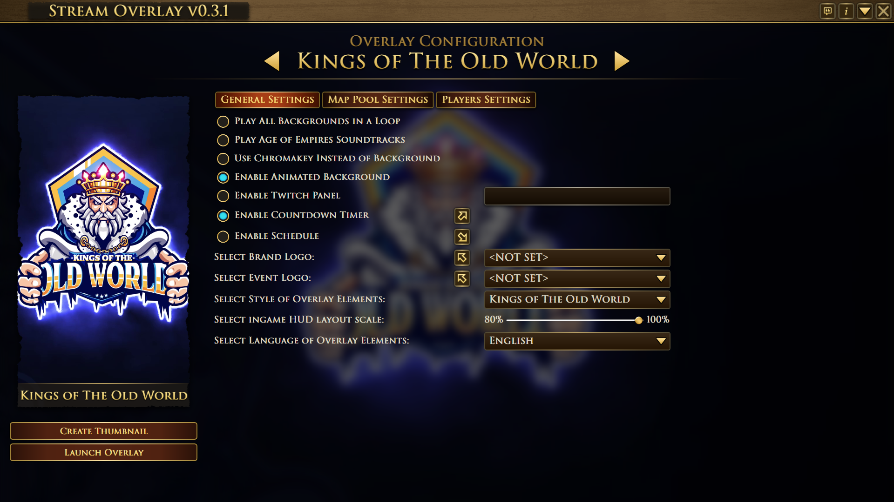
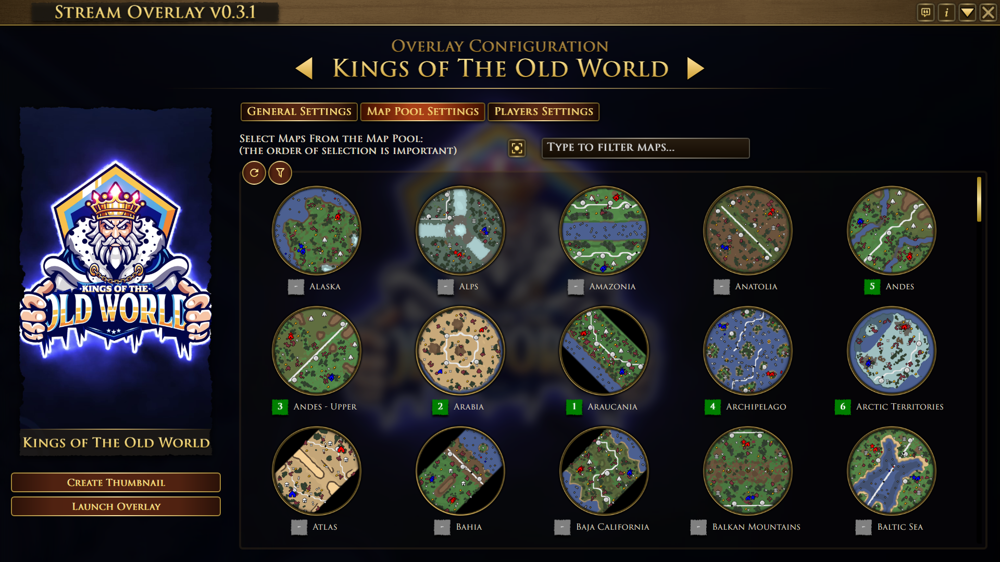
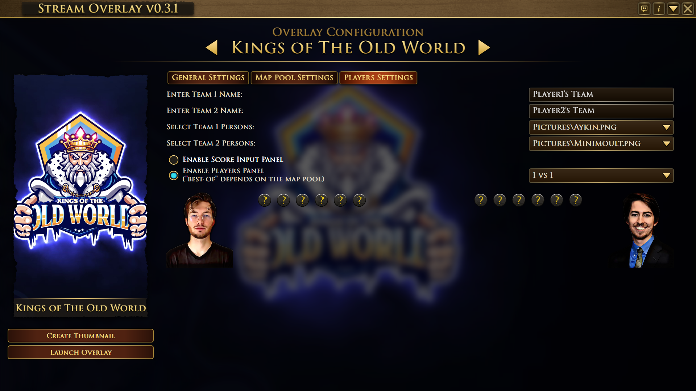

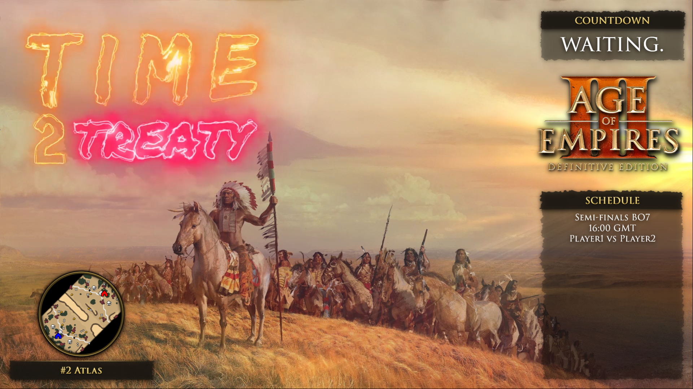
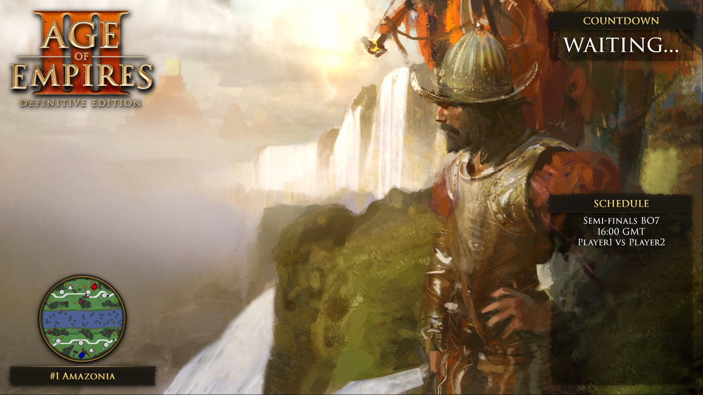
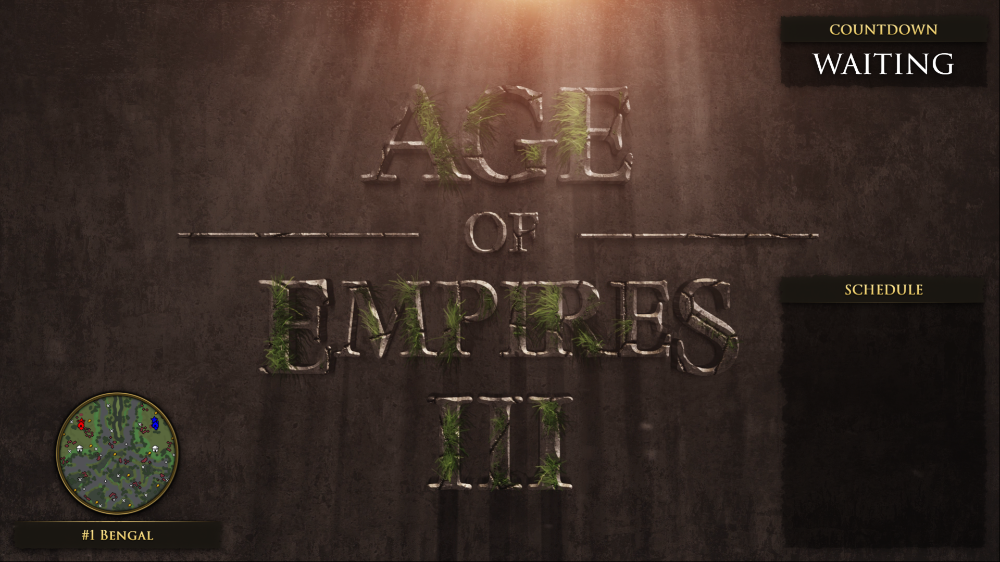
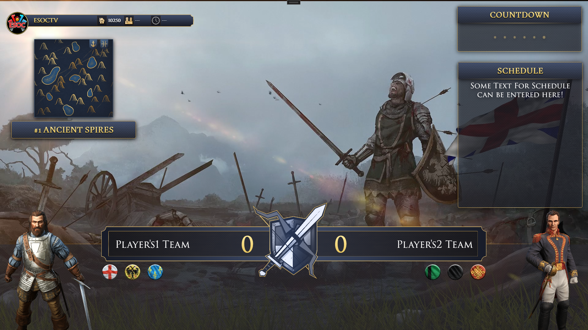
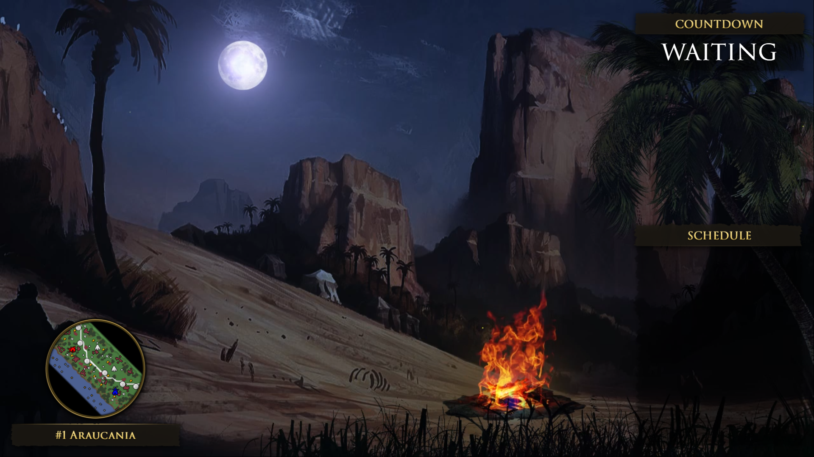

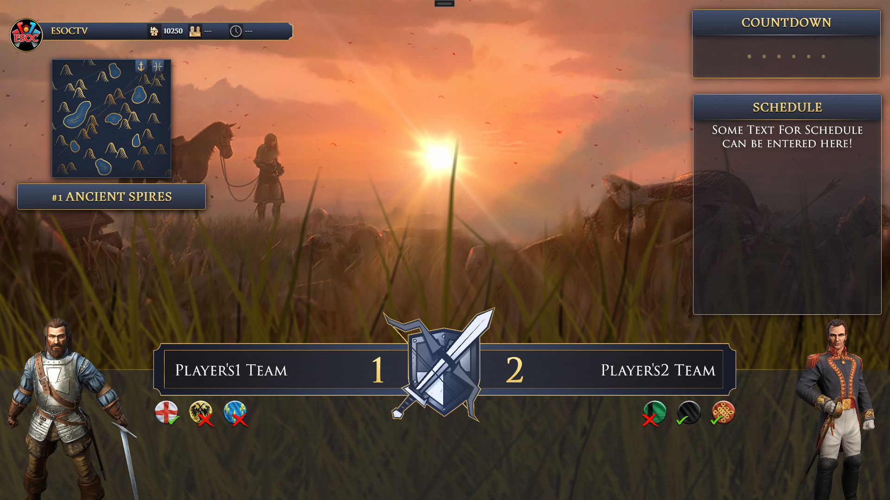

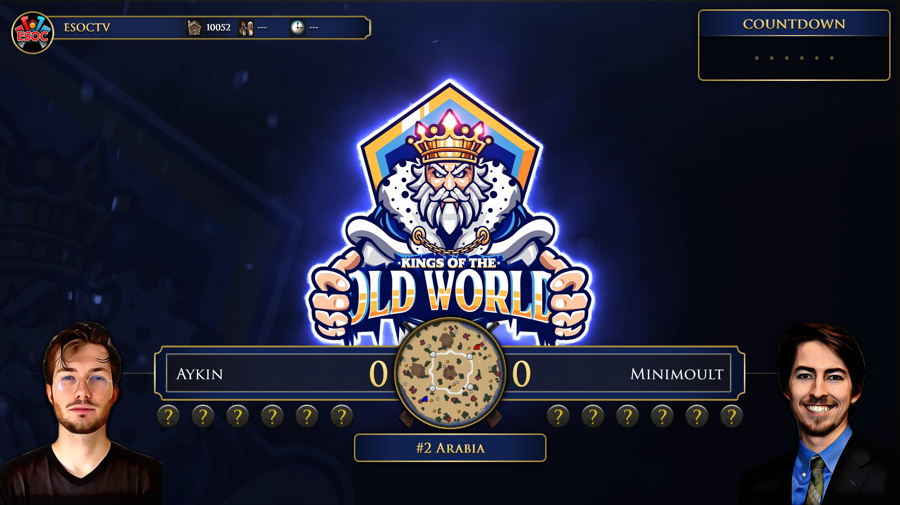
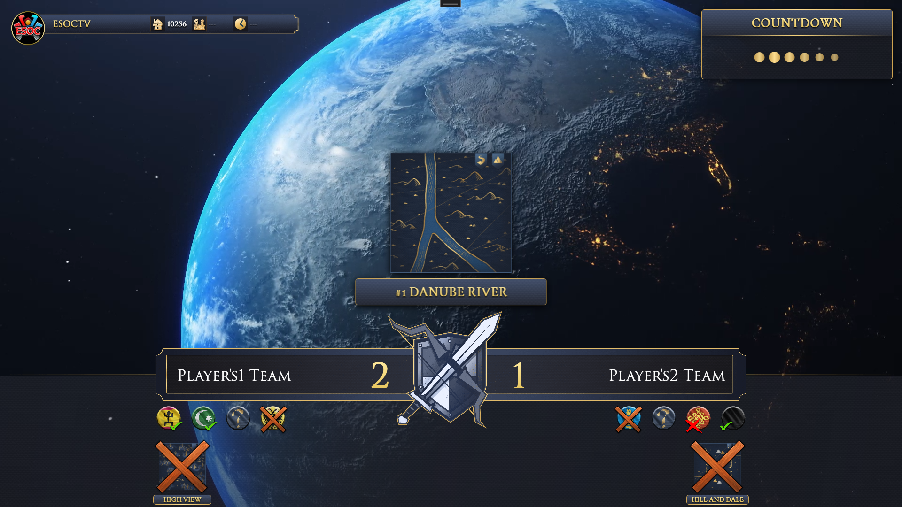
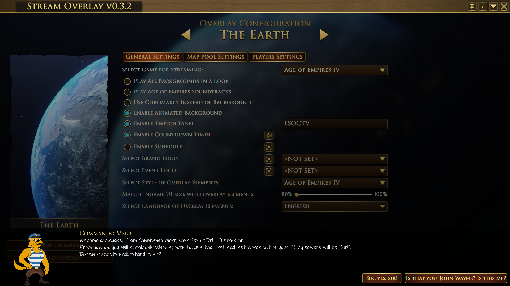

<!-- LICENSE -->
## License

Distributed under the MIT License. See `LICENSE` for more information.

<!-- CONTACT -->
## Contact

VladTheJunior - Discord: VladTheJunior#1244 - VladTheJunior@gmail.com

Project Link: [https://github.com/VladTheJunior/StreamOverlay](https://github.com/VladTheJunior/StreamOverlay)
